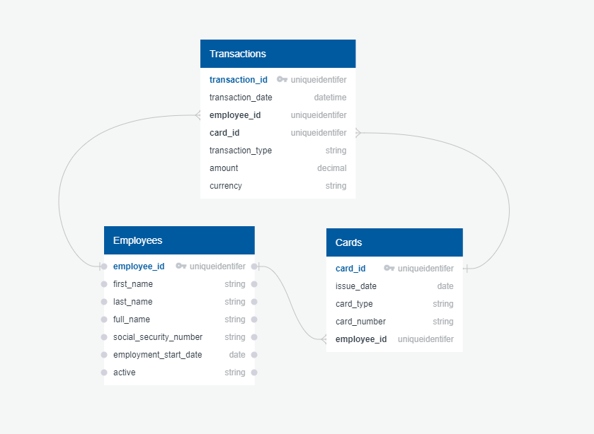

# Hydrogen Mock-Up API
Author: Ryan Marinelli

Date: December 2020

## Requirements 
Make a mock ‘GET /transactions’ REST API endpoint to pull transactions for a payroll debit card used by a company. Show the request and response with all of the fields.


## Installation

To run the REST API locally, follow these steps:

1. Download the zip of the repo or clone the repository locally
2. Unzip if necessary, and note the location of the **hydrogen** folder
3. Verify / install the following python packages (on their latest version). Use `pip install <package>` to add the package to your Anaconda Environment:
- pandas
- flask 
- flask_restful 
- requests
- ipywidgets

4. Open the Anaconda Prompt and enter the following to activate the Flask API app:
```
cd "<path to downloaded folder containing \hydrogren>"
python api.py
```
5. Once the local Flask Server is activated, copy and paste the "running on" URL into a web browser to access endpoints.
6. For a demo, launch `Jupyter Notebook` in the Anaconda Prompt and navigate to the `Payroll Transaction API Demo.ipynb` file. This Notebook will walk through how to make a `GET /transactions` request. 

# REST API 
**Endpoints:**
- /transactions
- /employees
- /cards

## /transactions
The `/transactions` endpoint sources its data from: `data/payroll_debit_card_transaction_data.csv`. The data was created as a sample based on research to determine key payroll attributes. 

Each transaction record contains a `transaction_id`(uniqueidentifier), the primary key for each transaction record. The `transaction_id` offers API users the ability to access an individual transaction record. The `employee_id` and `card_id` are also unique identifier's, instead of simple strings, to promote a schema that can appropriately scale for either a SMB or Enterprise company. Payrolls are an international process, thus the schema is designed in a scalable approach for international companies. The `amount` field is a decimal value paired with a `currency` column to enable payments in multiple currencies. 

The data has the following schema:

| field_name | field_type | field_description |
|:---|:------------|:-----------------|
| transaction_id | uniqueidentifier | Unique ID for each individual transaction.|
| transaction_date | datetime | The record transaction datetime. |
| employee_id | uniqueidentifier | Unique ID representing the employee object.|
| card_id | uniqueidentifier | Unique ID representing the cards object.|
| transaction_type | string | Representings the type of transaction: ['credit', 'debit']. credit' represents funds being added onto the employee card from the employer. 'debit' represents funds being withdrawn from the employee card and returned to the employeer.|
| amount | decimal | The amount of funds credited or debited onto the respective card_id. |
| currency | string | ISO 4217 currency code representing the currency used to credit or debit the card_id.  |

Example of a single `/transactions` record: 
```
 ['data': {'transaction_id': '12965e4b-06d0-4eab-bc8f-e73253a5f4f7', 
   'transaction_date': '8/6/2020 8:00', 
   'employee_id': '2A467E81-4FA7-4707-A9D7-AB38C8DDB6E0',
   'card_id': '80AA849E-2ABB-46A6-BC25-13723D3C6761', 
   'transaction_type': 'credit', 
   'amount': 39.0, 
   'currency': 'USD'}]
```
 
 
## /employees
The `/employees` endpoint sources its data from: `data/employee_profile_data.csv`, which represents employees who have a payroll debit card. The data was created as a sample based on research to determine key payroll & employee attributes. The `employee_id` field stores a unique identifier for each employee, creating a searchable and scalable schema for both SMB's or Enterprise Companies. The employee endpoint displays standard GDPR data such as `first_name`, `last_name`, and `full_name` for each employee. In the United States, a Social Security Number is required for payroll, but in order to protect employee information in the schema, the `social_security_number` field has been masked. Finally the table stores the employees first employment date (`employment_start_date`) and a flag field (`active`) to signal if the employee is active with the company. 

| field_name | field_type | field_description |
|:---|:------------|:-----------------|
| employee_id | uniqueidentifier | Unique ID for each individual employee.|
| first_name | string | First Name of the employee. |
| last_name | string | Last Name of the employee. |
| full_name | string | Full Name of the employee. |
| social_security_number | string | Masked storage of the employee's Social Security Number. |
| employment_start_date | date | The first date the employee started working at the company. |
| active | string | Signals if the employee is active at the company: ['Y', 'N']

Example of a single `/employees` record: 
```
['data': {'employee_id': '2A467E81-4FA7-4707-A9D7-AB38C8DDB6E0', 
   'first_name': 'Jack', 
   'last_name': 'Nicklaus', 
   'full_name': 'Jack Nicklaus', 
   'social_security_number': 'xxx-xx-0293', 
   'employment_start_date': '8/1/2020', 
   'active': 'Y'}]
}
```

## /cards 
The `/cards` endpoint sources its data from: `data/cards_data.csv`, which represents payroll debit card information.The data was created as a sample based on research to determine key payroll card attributes. The `card_id` field stores a unique identifier for each card, creating a searchable and scalable schema for both SMB's or Enterprise Companies. Key card information (PCI data) can be located in the `issue_date`, `card_type` and `card_number` fields. To protect card information, the `card_number` field has been masked. Finally, each `card_id` maps to an `employee_id`. This structure is designed as each employee can have multiple cards *(use case: A lost or stolen card)*.   

| field_name | field_type | field_description | 
|:---|:------------|:-----------------|
| card_id | uniqueidentifier | Unique ID for each individual card.|
| issue_date | date | Date the card was issues to the employee. |
| card_type | string | Represents the brand of card issued to the employee. |
| card_number | string | Masked storage of the employees card number. |
| employee_id | uniqueidentifier | Unique ID for each individual employee.|

Example of a single `/cards` record: 
```
 ['data': {'card_id': '9414340D-8BEA-4BB3-8B0A-0A419A84E14E', 
   'issue_date': '2020-10-02', 
   'card_type': 'visa', 
   'card_number': 'xxxx-xxxx-xxxx-1946', 
   'employee_id': '346E6235-FE4A-4C51-B646-56D07D29F7AA'}]
```

## Data Design Diagram


## Payroll Debit Card Research
What is a payroll debit card? 
- A secure, convenient and reloadable debit card, issued by an employer, with the primary purpose for employees to directly receive their wages and other compensation each pay period. 
	
What are the key payroll card features – Employer Perspective? 
- Offer employers a direct payment option for employees to access their paycheck or benefits. 
- Streamlines the employer payroll process by reducing the reliance on paper paychecks, setting up direct deposits, or needing employees to visit the workplace to pick up their paycheck.
	
What are the key payroll card features – Employee Perspective?
- Reliable Wage Payment: Automatically receive your paycheck directly on the card each pay period. Reduces the employees need to go to the office to collect their paycheck, cash their paycheck at a check casher, or wait for the funds to clear with a bank. Funds are available right away on the debit card. 
- Unbank: Employee does not need to have a bank account. An employee can get direct access to their funds. 
- Card Usability: Cards can be used to make purchases (in person, online) or to withdraw money from an ATM. Some cards can be used to pay bills directly. 
- Security: Cards offer fraud protection if lost or stolen, reducing the need for the employee to carry large sums of cash.  
- Privacy: Only the Card Issuer (Visa, Mastercard, etc.) and not the cardholder’s employer can track what the employee spends. Typically, the financial institution that issues the payroll card establishes a separate electronic subaccount for each employee. Once wages are deposited into the account, the employer loses access to the funds and has no ability to view transactions conducted by the cardholder. 
		
Key User Types:
- Unbanked employee: Employee who does not have a bank account. Employee would typically use a cash checking service
- Seasonal employee: Employee who may only work for a temporary period. Reduces the overhead for the employer to setup direct deposit
- Employee accessing Federal Benefits: Employee who obtains federal benefits such as medical leave or transit discount

